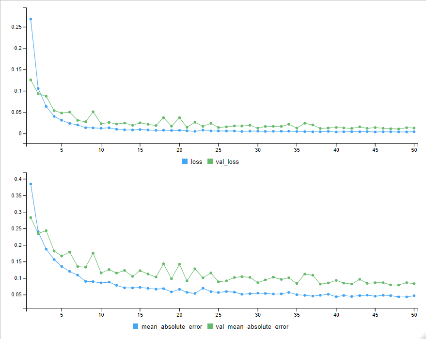
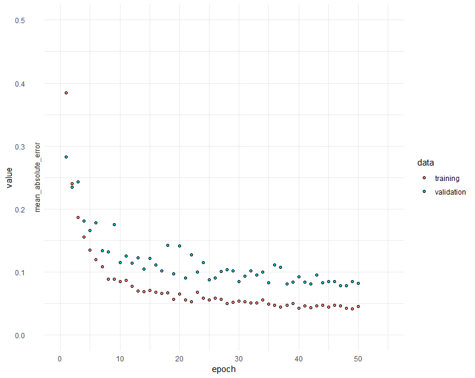
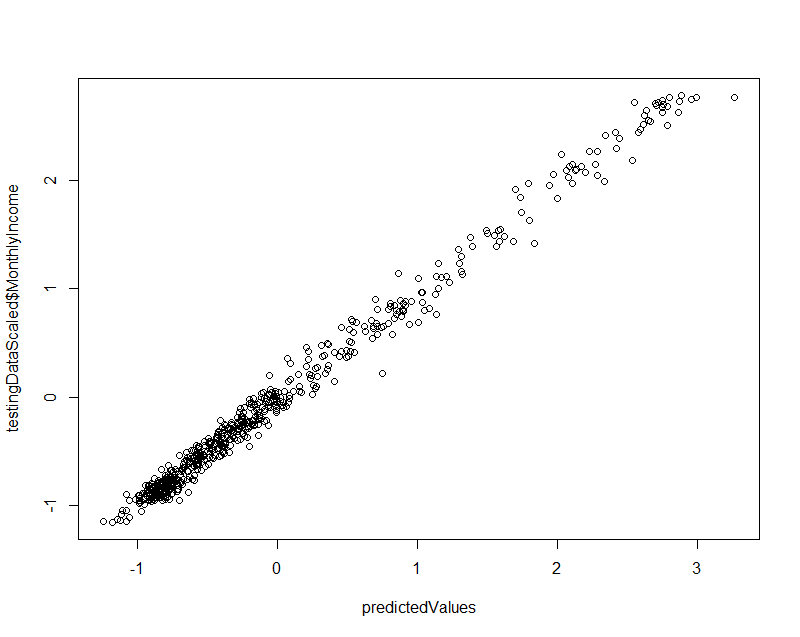
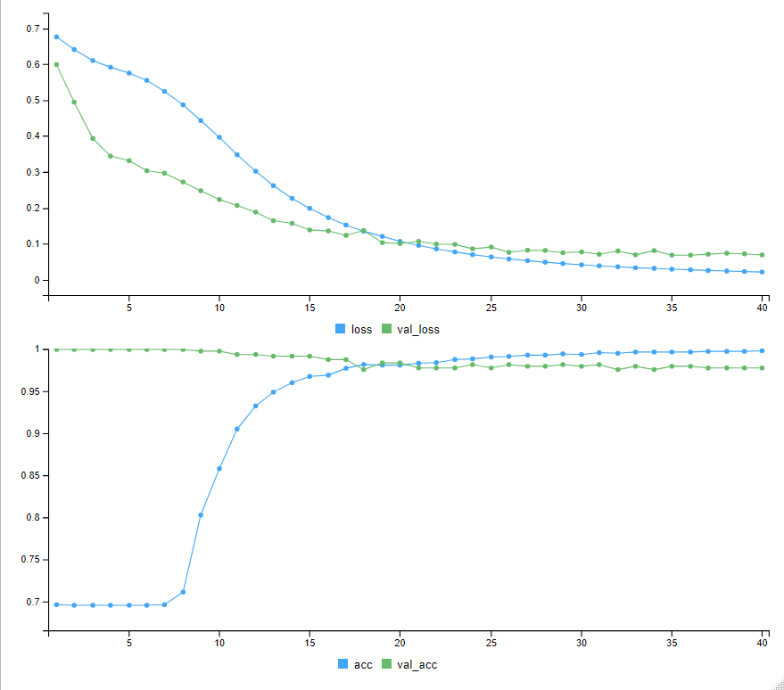
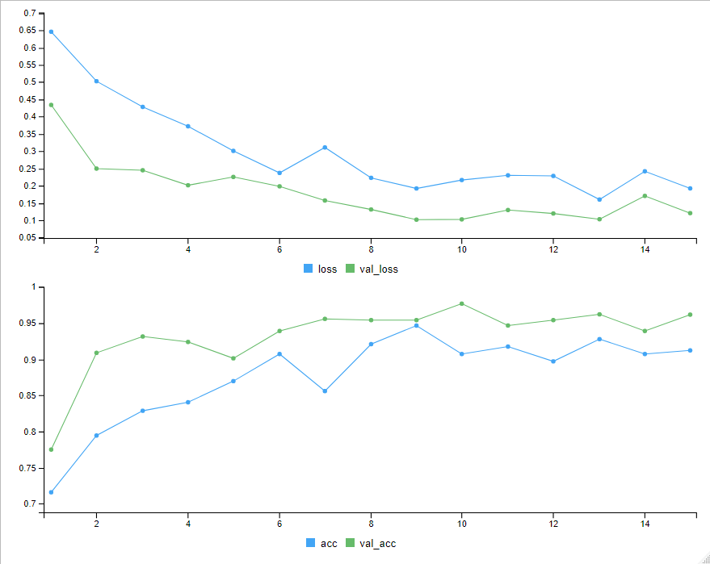
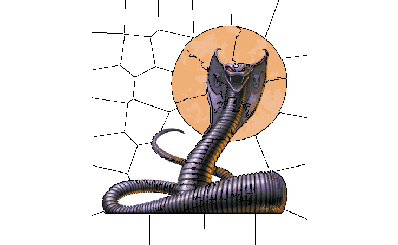
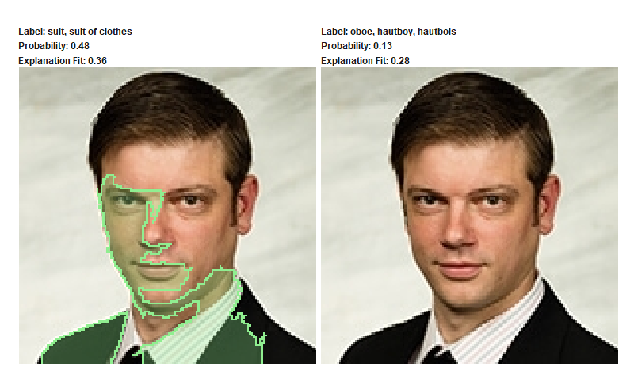
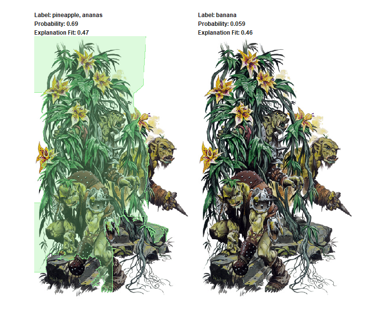

```{r setup, include=FALSE}
knitr::opts_chunk$set(echo = TRUE, warning = FALSE, message = FALSE, eval = FALSE)
```

# An Unvisited Past

Before we really get into what might be coming in the (near) future, it would be useful to get a glimpse of the what was helpful in the past. 

Many of the things that we have done together have been computationally intensive. Sometimes there is nothing to be done. Many problems, though, present well for using parallel computing. Instead of running a job on one core of your machine, you can choose to split the job up over how many cores your machine has (usually leaving 1 open for safety reasons).

```{r, eval = FALSE}
library(dplyr)

library(httr)

library(parallel)

library(rvest)

pictureLinks = read_html("https://mendoza.nd.edu/mendoza-directory?employeetype=All") %>% 
  html_nodes(".directory-image .profileimage") %>% 
  html_attr("src")

pictureLinks = pictureLinks[!duplicated(pictureLinks)]

pictureLinks = gsub("\\?.*", "", pictureLinks)

personNumbers = sprintf("%03d", 1:length(pictureLinks))

dir.create("D:/projects/courses/unstructured/data/kerasImages/monsters")

dir.create("D:/projects/courses/unstructured/data/kerasImages/people")

cl = makeCluster(detectCores() - 1)

clusterExport(cl, c("pictureLinks", "personNumbers"))

clusterEvalQ(cl, library(httr))

clusterEvalQ(cl, library(rvest))

parSapply(cl, 1:length(pictureLinks), function(x) {
  GET(pictureLinks[x], 
      write_disk(paste("D:/projects/courses/unstructured/data/kerasImages/people/person", 
                       personNumbers[x], ".jpg", sep = "")))
})

stopCluster(cl)


### Monsters ###

monsterLinks = read_html("http://www.iwozhere.com/SRD/Gallery.html") %>% 
  html_nodes(".gallerynamelink") %>% 
  html_attr("href")

monsters = grepl("(^monsters|^images).*jpg", monsterLinks)

monsterLinks = monsterLinks[which(monsters == TRUE)]

monsterLinks = sample(monsterLinks, 325, replace = FALSE)

monsterLinks = paste("http://www.iwozhere.com/SRD/", monsterLinks, sep = "")

monsterNumbers = sprintf("%03d", 1:length(monsterLinks))

cl = parallel::makeCluster(7)

clusterExport(cl, c("monsterLinks", "monsterNumbers"))

clusterEvalQ(cl, library(httr))

clusterEvalQ(cl, library(rvest))

parSapply(cl, 1:length(monsterLinks), function(x) {
  GET(monsterLinks[x], 
      write_disk(paste("D:/projects/courses/unstructured/data/kerasImages/monsters/monster", 
                       monsterNumbers[x], ".jpg", sep = "")))
})

stopCluster(cl)
```

Now that we have our data (and much faster than what we would have normally), we can split our data up into training, validation, and testing folders. 

```{r, eval = FALSE}
allPeople = list.files(path = "D:/projects/courses/unstructured/data/kerasImages/people/", 
                       full.names = TRUE)

allMonsters = list.files(path = "D:/projects/courses/unstructured/data/kerasImages/monsters/", 
                         full.names = TRUE)

# Split people into train/validate/test

allPeople = list.files(path = "D:/projects/courses/unstructured/data/kerasImages/people/", 
                       full.names = FALSE)

allMonsters = list.files(path = "D:/projects/courses/unstructured/data/kerasImages/monsters/", 
                         full.names = FALSE)

# Split people into train/validate/test

set.seed(1001)

peopleTrain = sample(1:length(allPeople), round(length(allPeople) * .5), replace = FALSE)

peopleTrainImages = allPeople[peopleTrain]

remainingPeople = allPeople[-peopleTrain]

peopleValidate = sample(1:length(remainingPeople), round(length(remainingPeople) * .5), replace = FALSE)

peopleValidateImages = remainingPeople[peopleValidate]

peopleTestImages = remainingPeople[-peopleValidate]

# Split monsters into train/validate/test

monstersTrain = sample(1:length(allMonsters), round(length(allMonsters) * .5), replace = FALSE)

monstersTrainImages = allMonsters[monstersTrain]

remainingMonsters = allMonsters[-monstersTrain]

monstersValidate = sample(1:length(remainingMonsters), round(length(remainingMonsters) * .5), replace = FALSE)

monstersValidateImages = remainingMonsters[monstersValidate]

monstersTestImages = remainingMonsters[-monstersValidate]

# Create directories and locate the images appropriately.

dir.create("D:/projects/courses/unstructured/data/kerasImages/train")

dir.create("D:/projects/courses/unstructured/data/kerasImages/validate")

dir.create("D:/projects/courses/unstructured/data/kerasImages/test")

dir.create("D:/projects/courses/unstructured/data/kerasImages/train/people")

dir.create("D:/projects/courses/unstructured/data/kerasImages/validate/people")

dir.create("D:/projects/courses/unstructured/data/kerasImages/test/people")

dir.create("D:/projects/courses/unstructured/data/kerasImages/train/monsters")

dir.create("D:/projects/courses/unstructured/data/kerasImages/validate/monsters")

dir.create("D:/projects/courses/unstructured/data/kerasImages/test/monsters")

file.copy(file.path("D:/projects/courses/unstructured/data/kerasImages/monsters/", monstersTrainImages),
          file.path("D:/projects/courses/unstructured/data/kerasImages/train/monsters")) 

file.copy(file.path("D:/projects/courses/unstructured/data/kerasImages/monsters/", monstersValidateImages),
          file.path("D:/projects/courses/unstructured/data/kerasImages/validate/monsters")) 

file.copy(file.path("D:/projects/courses/unstructured/data/kerasImages/monsters/", monstersTestImages),
          file.path("D:/projects/courses/unstructured/data/kerasImages/test/monsters")) 

file.copy(file.path("D:/projects/courses/unstructured/data/kerasImages/people/", peopleTrainImages),
          file.path("D:/projects/courses/unstructured/data/kerasImages/train/people")) 

file.copy(file.path("D:/projects/courses/unstructured/data/kerasImages/people/", peopleValidateImages),
          file.path("D:/projects/courses/unstructured/data/kerasImages/validate/people")) 

file.copy(file.path("D:/projects/courses/unstructured/data/kerasImages/people/", peopleValidateImages),
          file.path("D:/projects/courses/unstructured/data/kerasImages/test/people")) 
```

We are just going to hold off on using this for a while, but it will be important in a bit.


# Deep Convolutional Neural Networks

While we learned a bit about neural networks, the simple perceptron model is somewhat old news. Given the increase in computational power, new neural networks have become the go to model for speech and image classification.  

These models are particularly well-suited for images, but can be used on just about regression or classification problem that you might encounter. 

From a conceptual standpoint, they are not world away from what we previously saw. We have an input that gets passed through layers, weights and computations are applied through the layers, output is achieved and the system starts again. The biggest difference between these deep nets and what we saw a few weeks ago is in the complexity. We can have many hidden layers and the layers can be incredibly deep.


Here is the same diagram, but with a clearer depiction.


Here we are breaking image features down that get passed into the convolutional layer (typically with a Rectified Linear Unit activation).

<aside>
The ReLU activation is probably what you will most commonly see for these models. They are flexible, will deal with interactions and nonlinearities, and provide consistently great results.
</aside>

The softmax function we see at the end is just providing the mapping of the output to class probability distribution.

# TensorFlow

There are many deep-learning languages out there now: Torch, Caffe, H_2O, and Theano, to name a few. TensorFlow, however, seems to be doing a pretty good job at being popular. In addition to its popularity, it can also play nicely in many different languages.

The big question is...what is it? Basically, it is just a numeric computation engine.


# Keras

Keras has been built as a front-end for different lower-level libraries (like TensorFlow). It just serves to make TensorFlow easier to use.

```{r}
library(keras)

install_keras(tensorflow = "gpu")
```

## Regression

Classification is always a fun task, but we should note that anything we would normally do on the modeling side can be done in Keras. 

Let's go back to that `attrition` data that we played with when we were using Naive Bayes.

```{r}
library(rsample)

library(ggplot2)

splits = initial_split(attrition, .6)

trainingDataWhole = training(splits)

trainingDataWhole = trainingDataWhole %>% 
  select_if(is.numeric)

trainingDataScaled = scale(trainingDataWhole)

colMeansTraining = attr(trainingDataScaled, "scaled:center")

colSDTraining = attr(trainingDataScaled, "scaled:scale")

trainingDataScaled = as.data.frame(trainingDataScaled)

testingDataWhole = testing(splits)

testingDataScaled = testingDataWhole %>% 
  select_if(is.numeric) 

testingDataScaled = as.data.frame(scale(testingDataScaled, 
                                        center = colMeansTraining, scale = colSDTraining))

yVar = which(names(attrition) == "MonthlyIncome")

trainingY = as.vector(trainingDataScaled$MonthlyIncome)

trainingData = data.matrix(trainingDataScaled[, -c(yVar)])

testingY = as.vector(testingDataScaled$MonthlyIncome)

testingData = data.matrix(testingDataScaled[, -c(yVar)])

model = keras_model_sequential() %>%
    layer_dense(units = 64, activation = "relu",
                input_shape = dim(trainingData)[2]) %>%
    layer_dense(units = 64, activation = "relu") %>%
    layer_dense(units = 1)
  
model %>% 
  compile(loss = "mse", optimizer = optimizer_rmsprop(),
          metrics = list("mean_absolute_error"))

model %>% summary()

history = model %>% 
  fit(trainingData, trainingY,
  epochs = 50, validation_split = 0.2,
  verbose = 2)
```




```{r}
plot(history, metrics = "mean_absolute_error", smooth = FALSE) +
  coord_cartesian(xlim = c(0, 55), ylim = c(0, .5)) + 
  theme_minimal()
```



```{r}
predictedValues = model %>% predict(testingData)

plot(predictedValues, testingDataScaled$MonthlyIncome)
```




That is all great, but let's see what we would have gotten with a normal linear regression:

```{r}
trainModel = lm(MonthlyIncome ~ ., data = trainingDataScaled)

lmPredicted = predict(trainModel, testingDataScaled)

plot(lmPredicted, testingDataScaled$MonthlyIncome)
```


### The Black Box...

While getting a clear look into the black box can be tricky, there are ways to help to explain what is going on within any of these machine learning algorithms. Locally Interpretable Model-Agnostic Explanations

The `lime` package will give us some insight into our models. 

```{r}
library(lime)

model_type.keras.engine.sequential.Sequential = function(x, ...) "regression"

# Setup lime::predict_model()
predict_model.keras.engine.sequential.Sequential  = function(x, newdata, type, ...) {
  pred = predict(object = x, x = as.matrix(newdata))
  data.frame(pred) 
}

predict_model(x = model, newdata = trainingData, type = 'raw')

explainer <- lime(x = as.data.frame(trainingData), model)

explanation = explain(as.data.frame(testingData), explainer, n_features = 2)
```


```{r,eval=TRUE, echo=FALSE}
load("D:/projects/courses/unstructured/notes/explanationOut.RData")

rmarkdown::paged_table(explanation[,2:9])
```


## Text Classification

Since we are going to be using TensorFlow, we will need to convert our data to tensors. It is a substantial amount of work. Functions (or functional programming) should definitely be used here, but this will just make the steps concrete.

```{r}
library(dplyr)

load("D:/projects/courses/unstructured/data/zappaOrCountry.RData")

zappaOrCountry = zappaOrCountry %>% 
  mutate(zappaNY = ifelse(genre == "zappa", 1, 0)) %>% 
  select(text, zappaNY)

splits = initial_split(zappaOrCountry, .6, "zappaNY")

trainingDataWhole = training(splits)

testingDataWhole = testing(splits)

trainingLabel = as.vector(trainingDataWhole$zappaNY)

trainingData = as.array(trainingDataWhole[, -c(2)])

testingLabel = as.vector(testingDataWhole$zappaNY)

testingData = as.array(testingDataWhole[, -c(2)])

tokenizerTrain = text_tokenizer(num_words = 50000)

fit_text_tokenizer(tokenizerTrain, trainingData) # Many things are modified in place...

trainingData = texts_to_sequences(tokenizerTrain, trainingData)

tokenizerTest = text_tokenizer(num_words = 50000)

fit_text_tokenizer(tokenizerTest, testingData)

testingData = texts_to_sequences(tokenizerTest, testingData)

trainingData = pad_sequences(trainingData, value = 0,
  padding = "post", maxlen = 400)

testingData = pad_sequences(testingData, value = 0,
  padding = "post", maxlen = 400)

```

For the love of all that is good, we can start getting to our model now:

```{r}
vocabSize = 50000

model = keras_model_sequential()

model %>% 
  layer_embedding(input_dim = vocabSize, output_dim = 16) %>%
  layer_global_average_pooling_1d() %>%
  layer_dense(units = 16, activation = "relu") %>%
  layer_dense(units = 1, activation = "sigmoid")

model %>% summary()
```

```{r}
model %>% compile(optimizer = 'adam', loss = 'binary_crossentropy',
  metrics = list('accuracy'))
```


```{r}
xValidation = trainingData[1:500, ]

xTraining = trainingData[501:nrow(trainingData), ]

yValidation = trainingLabel[1:500]

yTraining = trainingLabel[501:length(trainingLabel)]

history = model %>% 
  fit(xTraining, yTraining,
      epochs = 40, batch_size = 50,
      validation_data = list(xValidation, yValidation),
      verbose = 3)
```



We can see that our model generally improved after every epoch (we do see some that our validation tended to drop). The loss is notable here and just refers to the distance of an observation from a prediction -- as we approach 0, we are getting closer to perfect prediction.  

## Model Explanations

For giggles, we can take the same data and run it through a boosted gradient descent classifier.

<aside>
A boosted model will combine the votes from several models (*bagging*) and then will build another model trained on the misclassified examples from the first model.
</aside>

```{r}
library(lime)

library(xgboost)

library(text2vec)

getMatrix = function(text) {
  tokenized = itoken(text, progressbar = FALSE)
  create_dtm(tokenized, vectorizer = hash_vectorizer())
}

trainingDTM = getMatrix(trainingDataWhole$text)

testingDTM = getMatrix(testingDataWhole$text)

params = list(max_depth = 7, eta = 0.1, 
              objective = "binary:logistic", 
              eval_metric = "error", 
              nthread = 1)

xgbModel = xgb.train(params, xgb.DMatrix(trainingDTM, 
                                          label = trainingDataWhole$zappaNY),
  nrounds = 50)

predictions = predict(xgbModel, testingDTM) > 0.5

test_labels = testingDataWhole$zappaNY

meanAccuracy = mean(predictions == test_labels)

meanAccuracy
```

```{r,echo=FALSE, eval=TRUE}
load("D:/projects/courses/unstructured/notes/limeExplanations.RData")

meanAccuracy
```


```{r}
sentenceExplanation = head(testingDataWhole$text[testingDataWhole$zappaNY == 0], 15)

explainerCountry = lime(sentenceExplanation, model = xgbModel, 
                  preprocess = getMatrix)

explanationCountry = explain(sentenceExplanation, explainerCountry, n_labels = 1, 
                       n_features = 2)

explanationCountry[, 2:9]
```

```{r,echo=FALSE, eval=TRUE}
rmarkdown::paged_table(explanation[,2:9])
```


```{r}
zappaExplanation = tail(testingDataWhole$text[testingDataWhole$zappaNY == 1], 3)

explainerZappa = lime(zappaExplanation, model = xgbModel, 
                  preprocess = getMatrix)

explanationZappa = explain(zappaExplanation, explainerZappa, n_labels = 1, 
                       n_features = 2)

explanationZappa[, 2:9]
```

```{r,echo=FALSE, eval=TRUE}
rmarkdown::paged_table(explanation[,2:9])
```

 
## Images

Now we can go back to those images we created earlier. The previous deep net model we ran was just that -- a deep net. Since we are dealing with images, now, we can use the convolutional layers.

We will replicate the model diagram that we saw earlier, but we could obviously tweak until we could not see straight.

```{r}
trainingDirectory = "D:/projects/courses/unstructured/data/kerasImages/train/"

validationDirectory = "D:/projects/courses/unstructured/data/kerasImages/validate/"

imageWidth = 20

imageHeight = 20

targetSize = c(imageWidth, imageHeight)

# RGB = 3 channels

channels = 3

# We can increase our training set by using image generation.
# This will decrease our chances of overfitting with small data.

trainingDataGenerator = image_data_generator(rescale = 1/255, rotation_range = 40,
                                             width_shift_range = 0.2,
                                             height_shift_range = 0.2,
                                             shear_range = 0.2,
                                             zoom_range = 0.2,
                                             horizontal_flip = TRUE)

validationDataGenerator = image_data_generator(rescale = 1/255)  

testDataGenerator = image_data_generator(rescale = 1/255)  

trainingImagesArray = flow_images_from_directory(trainingDirectory, 
                                          trainingDataGenerator,
                                          target_size = targetSize,
                                          class_mode = "categorical",
                                          classes = c("people", "monsters"),
                                          seed = 1001)

# validation images
validationImagesArray = flow_images_from_directory(validationDirectory, 
                                          validationDataGenerator,
                                          target_size = targetSize,
                                          class_mode = "categorical",
                                          classes = c("people", "monsters"),
                                          seed = 1001)

trainSamplesN = trainingImagesArray$n

validateSamplesN = validationImagesArray$n

model = keras_model_sequential()

# add layers
model %>%
  layer_conv_2d(filter = 32, kernel_size = c(3, 3), padding = "same", 
                input_shape = c(imageWidth, imageHeight, channels)) %>%
  layer_activation("relu") %>% 
  
  # Second hidden layer
  layer_conv_2d(filter = 16, kernel_size = c(3, 3), padding = "same") %>%
  layer_activation_leaky_relu(0.5) %>%
  layer_batch_normalization() %>%

  # Use max pooling
  layer_max_pooling_2d(pool_size = c(2, 2)) %>%
  layer_dropout(0.25) %>%
  
  # Flatten max filtered output into feature vector 
  # and feed into dense layer
  layer_flatten() %>%
  layer_dense(100) %>%
  layer_activation("relu") %>%
  layer_dropout(0.5) %>%

  # Outputs from dense layer are projected onto output layer
  layer_dense(2) %>% 
  layer_activation("softmax")

# compile
model %>% compile(
  loss = "categorical_crossentropy",
  optimizer = optimizer_rmsprop(lr = 0.0001, decay = 1e-6),
  metrics = "accuracy")

history = model %>% fit_generator(trainingImagesArray,
  steps_per_epoch = as.integer(trainSamplesN / 32), 
  epochs = 15, validation_data = validationImagesArray,
  validation_steps = as.integer(validateSamplesN / 32),
  verbose = 2)
```



We can see that we started getting pretty good accuracy towards the end of our epochs. 

## Pretrained Models

There will be times to train your own models, but sometimes a previously used model is useful. If you are trying to identify common items, 

```{r}
library(lime)

library(magick)

plot_superpixels("D:/projects/courses/unstructured/data/kerasImages/train/monsters/monster001.jpg")
```



```{r}
testMonster = image_read("D:/projects/courses/unstructured/data/kerasImages/test/monsters/monster007.jpg")

image_write(testMonster, "D:/projects/courses/unstructured/data/kerasImages/test/monsters/monsterTest.jpg")

testPerson = image_read("D:/projects/courses/unstructured/data/kerasImages/train/people/person026.jpg")

image_write(testPerson, "D:/projects/courses/unstructured/data/kerasImages/test/people/personTest.jpg")

testMonster = "D:/projects/courses/unstructured/data/kerasImages/test/monsters/monsterTest.jpg" 

testPerson = "D:/projects/courses/unstructured/data/kerasImages/test/people/personTest.jpg"

model2 = application_vgg16(weights = "imagenet", include_top = TRUE)

model_labels = readRDS(system.file('extdata', 'imagenet_labels.rds', package = 'lime'))

image_prep = function(x) {
  arrays = lapply(x, function(path) {
    img = image_load(path, target_size = c(224,224))
    x = image_to_array(img)
    x = array_reshape(x, c(1, dim(x)))
    x = imagenet_preprocess_input(x)
  })
  do.call(abind::abind, c(arrays, list(along = 1)))
}

res = predict(model2, image_prep(c(testPerson, testMonster)))

imagenet_decode_predictions(res)
```

```{r, echo = FALSE, eval = TRUE}
load("D:/projects/courses/unstructured/notes/imageNetPred.RData")

res1
```

Those appear to be interesting pictures.

Let's check them out.

```{r}
explainer = lime(c(testPerson, testMonster), 
                 as_classifier(model2, model_labels), image_prep)

explanation = explain(c(testPerson, testMonster), explainer, 
                       n_labels = 2, n_features = 35,
                       n_superpixels = 35, weight = 10,
                       background = "white")

plot_image_explanation(explanation)

plot_image_explanation(explanation[explanation$case == "monsterTest.jpg", ])
```



